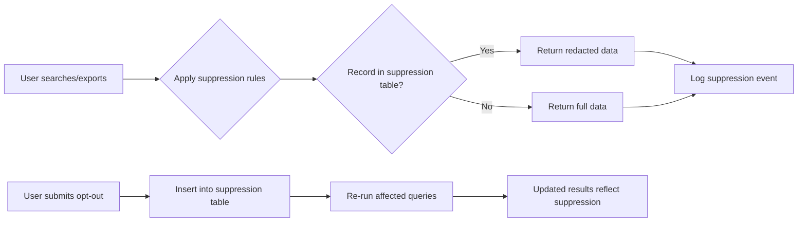
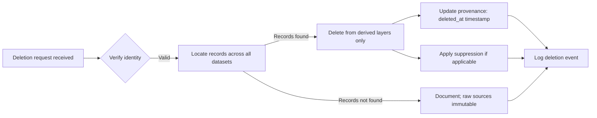
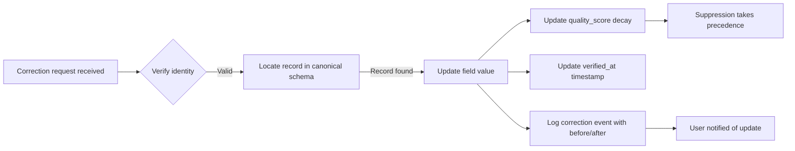

# LeadEngine Compliance Report

## Executive Summary

This report analyzes LeadEngine's data sources for legal compliance under GDPR, CCPA, and California Appropriations Law (CAL), designs suppression architecture, establishes a privacy review process, and creates a licensing review checklist. The project processes approximately 384M B2B records across multiple scraped datasets (LinkedIn, Crunchbase, Apollo, Pitchbook, Clutch.co). Special attention is required because B2B personal data may still be subject to privacy laws depending on jurisdiction and context.

---

## 1. Data Source Legal Compliance Analysis

### 1.1 Dataset Inventory and Compliance Risks

| Dataset | Records | Owner | Format | Key compliance concerns |
|---|---|---|---|---|
| **Entire Apollo Database** | ~480 GB | Apollo | Parquet | Largest dataset; Apollo's licensing terms must be verified for resale rights; GDPR applicability for EU citizens |
| **Entire Linkedin Database** | ~435M records | Apollo/LinkedIn | Unknown | Scraped LinkedIn data: LinkedIn's TOS prohibits scraping; GDPR applies to EU residents' profile data |
| **Apollo Software Development Leads** | ~111K | Apollo | Unknown | Narrower scope; licensing terms applicable |
| **Almost Full Crunchbase Database** | ~2.8M records | Crunchbase | Parquet | Crunchbase terms likely restrict resale; personal data profiling concerns |
| **Crunchbase** | ~40 GB | Crunchbase | Parquet | Same as above |
| **Phone Leads** | ~321K | Unknown | Unknown | Phone data has heightened sensitivity under CCPA/GDPR |
| **Clutch.co Database** | ~194K | Clutch.co | Parquet | Business directory data; may have different licensing terms |
| **NinjaLeads Database** | ~238K | Unknown | Unknown | Unknown licensing/privacy status |
| **Real Estate Agents 830K** | ~830K | Unknown | Unknown | Sector-specific regulations may apply |
| **Getlanka Database** | ~24K | Unknown | Unknown | Fragmented JSON noted in registry; quality and provenance issues |
| **Seamless Database** | ~1.5M | Unknown | Unknown | Unknown compliance profile |
| **Instagram - 843K** | ~843K | Unknown | Unknown | Social media scraped data; platform TOS likely restrict commercial resale |
| **Company Using X Technology - 10M** | ~10M | Unknown | Unknown | Technology association data |
| **Pitchbook 2025-06-21** | Unknown | Pitchbook | Parquet | Investment data; likely restricted licensing |
| **Pitchbook 2025-09-14** | Unknown | Pitchbook | Parquet | Same as above |
| **USA Database Business Leads** | ~9.98M | Unknown | Unknown | "USA" designation invokes CCPA/CAL considerations |

### 1.2 Lawful Basis Assessment

- **GDPR (EU/UK)**: Applies to any data relating to EU-identified/identifiable persons. Lawful basis must be established for each processing operation. Legitimate interests may apply for B2B marketing but requires balancing test. Consent may be needed for certain processing.
- **CCPA (California)**: Applies to California residents' personal information. "Personal information" includes email, phone, name + identifier. Businesses must provide opt-out mechanisms for sale/sharing.
- **CAL (California Appropriations Law)**: Specific provisions regarding personal information collection and use; overlaps with CCPA but has distinct consent and disclosure requirements.

### 1.3 Special Category Considerations

- **Scraped data**: Does not automatically equal licensed data. Platform Terms of Service (LinkedIn, Crunchbase, Pitchbook) may prohibit commercial resale regardless of public availability.
- **Phone numbers**: Heightened sensitivity under both GDPR (special category considerations in some interpretations) and CCPA.
- **Company data vs. person data**: B2B contact information may still constitute "personal data" under GDPR if the individual is identifiable.

---

## 2. Suppression Architecture Design

### 2.1 Suppression Schema

The suppression system uses a dedicated suppression table that is applied at read-time during search/reveal/export operations.

```text
suppression_id (PK, UUID)
email (string, nullable)
phone (string, nullable)
person_id (UUID, FK → persons.id, nullable)
company_id (UUID → companies.id, nullable)
domain (string, nullable)  -- e.g., company email domain
social_url (string, nullable)
reason (enum: opt-out, legal, request, expired)
source (string)  -- originating dataset
created_at (timestamp)
expires_at (timestamp, nullable)  -- for time-limited suppressions
```

### 2.2 Suppression Application Layers

| Layer | Mechanism | Scope |
|---|---|---|
| **Search API** | Pre-query suppression JOIN on suppression table | All search responses exclude suppressed records/fields |
| **Export endpoints** | Suppression filter applied before export generation | Download/CSV exports respect opt-outs |
| **Reveal/Profile views** | Field-level suppression (email/phone masked) | User-facing profiles hide opt-out user data |
| **Audit trail** | Suppression events logged with person_id, reason, source | Enables compliance reporting and reinstatement |

### 2.3 Suppression Workflow



### 2.4 Implementation Priorities

1. **Create suppression table** in DuckDB with the schema above
2. **Build suppression JOIN function** that applies to all search/reveal/export queries
3. **Build opt-out UI** for users to submit email/phone for suppression
4. **Implement batch suppression** for bulk uploads (CSV/Excel)
5. **Add expiration logic** for time-limited suppressions (e.g., "do not contact for 30 days")
6. **Audit logging** of all suppression events

---

## 3. Privacy Review Process

### 3.1 Privacy Review Checklist (Per Dataset/Feature)

Each new dataset or feature must pass this review before production deployment:

#### Data Inventory
- [ ] **Data source identified and documented** (origin, collection method, collection date)
- [ ] **Data categories classified** (name, email, phone, job title, company, location, etc.)
- [ ] **Lawful basis documented** for each data category (GDPR: legitimate interests, consent, contract; CCPA: business purpose, opt-out)
- [ ] **Jurisdictional scope determined** (which users' data falls under which law)

#### Provenance & Lineage
- [ ] **Source tracking implemented** (every record carries `source`, `source_record_id`)
- [ ] **Observed_at, ingested_at, verified_at timestamps** preserved
- [ ] **Quality scores and confidence metrics** tracked
- [ ] **Quarantine process for corrupted/invalid records** operational

#### Privacy Controls
- [ ] **Suppression architecture integrated** (opt-out emails/phones in suppression table)
- [ ] **Access controls defined** (who can view/modify personal data)
- [ ] **Retention policy defined** (see Section 4)
- [ ] **Deletion workflow documented** (how to honor erasure requests)
- [ ] **Correction workflow documented** (how to honor rectification requests)

#### Legal & Compliance
- [ ] **Source licensing reviewed** (terms of resale, redistribution rights)
- [ ] **Platform Terms of Service compliance** (LinkedIn, Crunchbase, Pitchbook TOS)
- [ ] **Data broker obligations assessed** (if applicable)
- [ ] **Privacy notice updated** to cover all data categories and sources
- [ ] **Retention policy documented and enforceable**

#### Technical Safeguards
- [ ] **Parameterized queries used** (ADR-004: no string-built SQL values)
- [ ] **Allowlists for dataset/column/sort identifiers** (no dynamic SQL)
- [ ] **Cursor/keyset pagination** (no unbounded result sets)
- [ ] **Suppression applied at read-time** for all search/reveal/export operations

### 3.2 Review Workflow

```mermaid
sequence participant Engineer
participant Legal
participant DataEngineer
participant PrivacyOfficer

Engineer -->|Submit privacy review form| Legal
Legal -->|Initial assessment| PrivacyOfficer
PrivacyOfficer -->|Requirements| Engineer
Engineer -->|Implement controls| DataEngineer
DataEngineer -->|Implementation complete| PrivacyOfficer
PrivacyOfficer -->|Sign-off| Legal
Legal -->|Final approval| Engineer
```

### 3.3 Review Triggers

New dataset addition, feature launch, source schema change, retention policy update, user request (access/deletion/correction), jurisdiction change.

---

## 4. Licensing Review Checklist

### 4.1 Source-Level License Assessment

| Source | Dataset | Licensing Status | Resale Allowed? | Notes |
|---|---|---|---|---|
| Apollo | Entire Apollo Database | Not verified | Unknown | Largest dataset; critical to verify |
| Apollo | Apollo Software Development Leads | Not verified | Unknown | |
| Crunchbase | Entire Crunchbase Database | Not verified | Unknown | Terms likely restrict resale |
| Crunchbase | Crunchbase (40 GB) | Not verified | Unknown | |
| LinkedIn | Entire LinkedIn Database | Not verified | Likely NO | Scraped TOS violation risk |
| LinkedIn | Apollo Software Development Leads | Not verified | Unknown | |
| Pitchbook | Pitchbook 2025-06-21 | Not verified | Unknown | Investment data |
| Pitchbook | Pitchbook 2025-09-14 | Not verified | Unknown | |
| Clutch.co | Clutch.co Database | Not verified | Unknown | Business directory |
| Getlanka | Getlanka Database | Not verified | Unknown | Fragmented JSON, quality issues |
| Seamless | Seamless Database | Not verified | Unknown | |
| Instagam | Instagram - 843K | Not verified | Likely NO | Platform TOS |
| Phone Leads | Phone Leads 321K | Not verified | Unknown | Heightened sensitivity |
| Clutch.co | Company Using X Technology | Not verified | Unknown | |
| Real Estate | Real Estate Agents 830K | Not verified | Unknown | Sector-specific |
| NinjaLeads | NinjaLeads Database | Not verified | Unknown | |
| Apollo | Fresh Apollo Leads 1.2M | Not verified | Unknown | |
| Apollo | Leads - CropReach AG-AgTech | Not verified | Unknown | |

**Critical finding: Zero datasets have verified licensing status.** All require immediate legal review before commercial launch.

### 4.2 Licensing Review Workflow

1. **Identify source owner** and obtain licensing agreement documentation
2. **Review terms for**: resale rights, redistribution rights, commercial use, derivative work rights, user opt-out obligations
3. **Classify each dataset** as: (a) fully licensed for resale, (b) licensed for internal use only, (c) prohibited for commercial use
4. **Document licensing decision** per source with: agreement reference, key clauses, expiration date, scope limitations
5. **Assign risk rating**: Low/Medium/High based on legal exposure
6. **Obtain legal sign-off** before any dataset is included in searchable/exportable data

### 4.3 Immediate Actions Required

- [ ] Contact Apollo for licensing terms on Entire Apollo Database and all Apollo-derived datasets
- [ ] Contact Crunchbase for terms of use regarding data resale and commercial exploitation
- [ ] Contact LinkedIn regarding scraping compliance and resale rights for profile data
- [ ] Contact Pitchbook regarding commercial use of pitchbook data
- [ ] Review Clutch.co's terms of service for commercial resale rights
- [ ] Add licensing review task to LEAD-004 tracking

---

## 5. Retention Policy Framework

### 5.1 Retention Schedule

| Data Category | Minimum Retention | Maximum Retention | Legal Basis | Review Frequency |
|---|---|---|---|---|
| **Person PII** (name, email, phone) | 12 months | 36 months | Legitimate interests / opt-out | Quarterly |
| **Company data** (name, domain, employee count) | 12 months | 48 months | Legitimate interests | Quarterly |
| **Suppression records** | Indefinite | Indefinite | Legal obligation | N/A (persistent) |
| **Provenance metadata** (source, observed_at, etc.) | 12 months | 36 months | Legitimate interests | Quarterly |
| **Query logs** | 3 months | 12 months | Legitimate interests | Monthly |
| **User session data** | 30 days | 90 days | Legitimate interests | Daily |
| **Export history** | 12 months | 24 months | Legal obligation | Quarterly |
| **Licensing records** | Duration of use | Duration of use | Contractual | Per agreement |

### 5.2 Retention Enforcement

- **Automated purge**: Scripts run quarterly to identify data exceeding maximum retention
- **Suppression records**: Persistent — never auto-expire unless explicitly marked with `expires_at`
- **Pseudonymization**: Before retention expiry, consider pseudonymizing PII while preserving utility
- **Backup consideration**: Backups retain data per backup retention policy; ensure backups also comply or are flagged

### 5.3 Deletion Workflow



**Key principle**: Raw source files are never mutated (ADR-002). Deletion applies to derived/cleaned layers only. A `deleted_at` timestamp is added to the canonical schema, and suppression rules override display.

### 5.4 Correction Workflow



---

## 6. Summary of Findings and Recommendations

### 6.1 Critical Issues

1. **Licensing unverified**: Zero datasets have confirmed licensing terms for commercial resale. This is the highest-risk item and must be resolved before launch.
2. **GDPR applicability**: 384M records include likely EU residents; lawful basis must be established for each processing operation.
3. **CCPA/CAL obligations**: California-resident data requires opt-out mechanisms and disclosure compliance.
4. **Scraped data TOS risk**: LinkedIn, Instagram, and potentially Pitchbook data may violate platform Terms of Service.
5. **Phone data sensitivity**: Heightened regulatory scrutiny on phone numbers under both regimes.

### 6.2 Immediate Actions (Next 30 Days)

- [ ] **Complete licensing review** for all 17+ data sources (engage legal counsel)
- [ ] **Implement suppression table** in DuckDB schema
- [ ] **Build opt-out submission mechanism** (email/phone)
- [ ] **Design and document privacy review process** (checklist in Section 3)
- [ ] **Define retention policy** with automated enforcement mechanisms
- [ ] **Update privacy notice** to cover all data sources and categories

### 6.3 Medium-Term (60-90 Days)

- [ ] **Integrate suppression into all search/reveal/export queries**
- [ ] **Build deletion/correction workflow** per Section 5
- [ ] **Conduct GDPR impact assessment** for EU-relevant data
- [ ] **Implement access control matrix** for data categories
- [ ] **Complete privacy notice** draft for legal review

### 6.4 Long-Term (120+ Days)

- [ ] **Regular compliance audits** (quarterly)
- [ ] **Jurisdiction monitoring** (law changes)
- [ ] **Data minimization reviews** (periodic reassessment of collected data)
- [ ] **Third-party processor agreements** if any data processing is outsourced

---

## 7. Compliance Checklist for LEAD-004

This checklist must be completed and signed off before LEAD-004 is marked DONE.

### 7.1 Source/Licensing Review
- [ ] All 17+ data sources have licensing agreements reviewed
- [ ] Resale rights confirmed or denied for each source
- [ ] Platform TOS compliance documented for each source
- [ ] Licensing decisions documented per source (agreement ref, key clauses, risk rating)
- [ ] Legal sign-off obtained on licensing status

### 7.2 Privacy Review
- [ ] Privacy review checklist completed for each new dataset/feature
- [ ] Lawful basis documented for each data category under GDPR and CCPA
- [ ] Suppression architecture implemented and tested
- [ ] Access controls defined and operational
- [ ] Deletion workflow tested with sample requests
- [ ] Correction workflow tested with sample requests

### 7.3 Suppression Architecture
- [ ] Suppression table created in DuckDB with schema from Section 2.1
- [ ] Suppression JOIN applied to all search API endpoints
- [ ] Suppression applied to export endpoints before generation
- [ ] Opt-out submission mechanism operational
- [ ] Audit logging of suppression events enabled

### 7.4 Retention Policy
- [ ] Retention schedule defined per data category (Section 5.1)
- [ ] Automated purge scripts designed (quarterly)
- [ ] Deletion workflow documented and tested
- [ ] Correction workflow documented and tested
- [ ] Backup compliance verified

### 7.5 Final Sign-Off
- [ ] Legal compliance officer sign-off obtained
- [ ] Privacy officer sign-off obtained
- [ ] All above checklists completed and documented in compliance_report.md